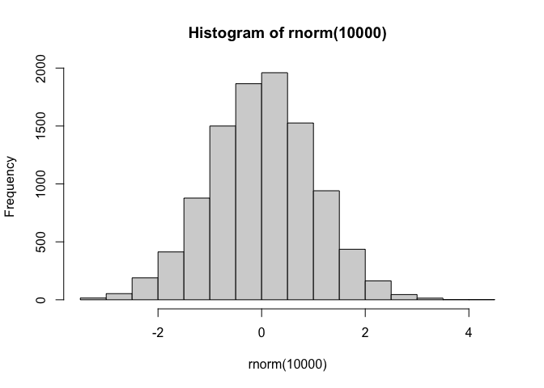
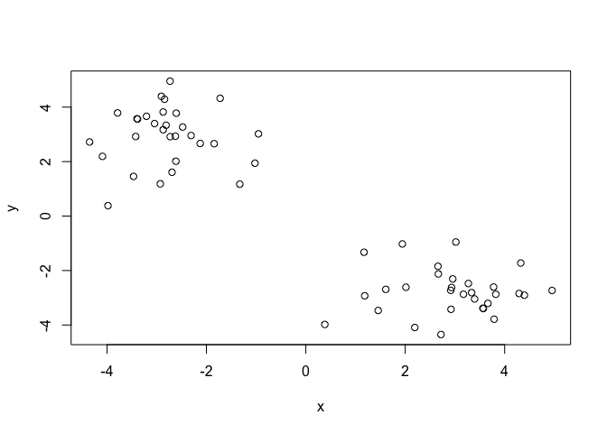
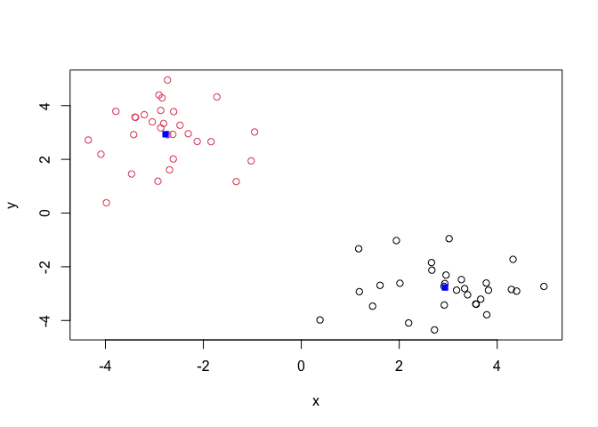
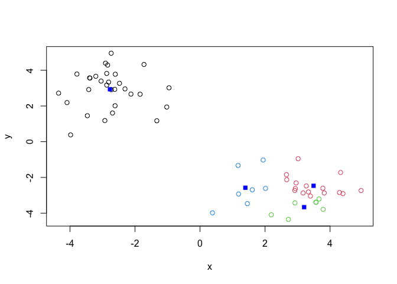
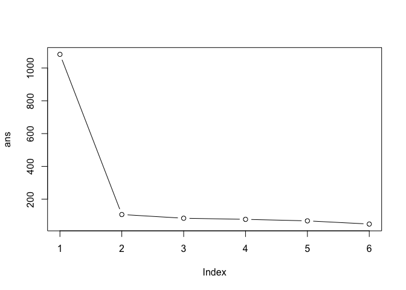
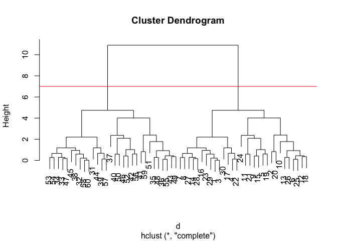
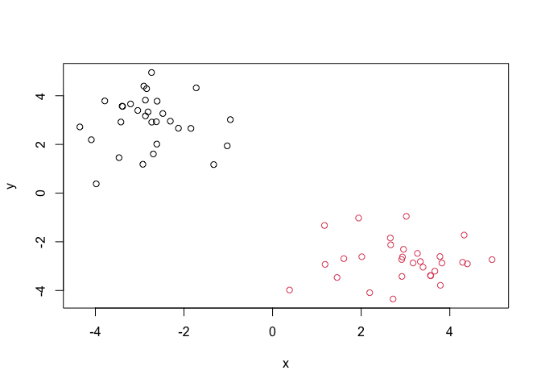
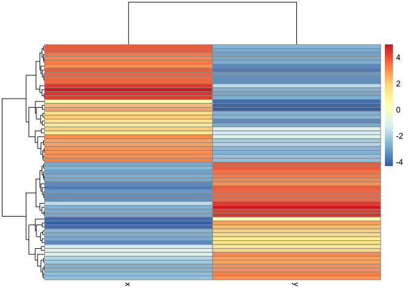
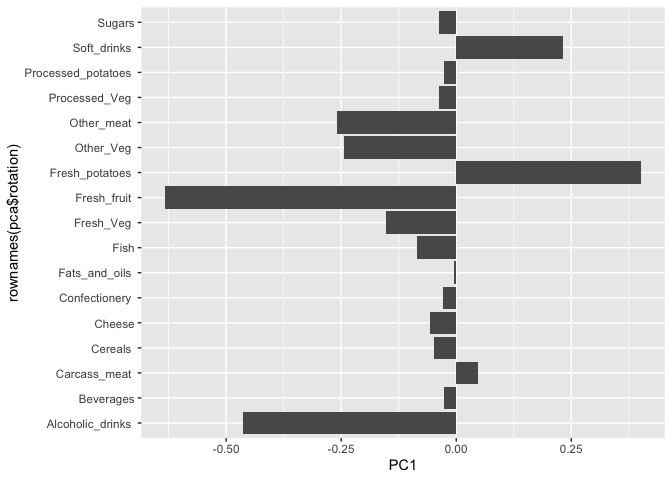

# Class 7: Machine Learning 1
Mario Gutierrez PID: A69043009

Today we will begin our exploratioon of some “classical” machine
learning approaches. We will star with clustering:

Let’s first make up some data to cluster where we know what the answer
should be.

``` r
rnorm(1000)
```

       [1]  4.134133e-01 -5.739334e-01 -5.793528e-01  1.094042e-01  1.883909e+00
       [6]  2.106115e-01 -6.743112e-01 -1.106407e+00  8.597933e-01  6.808475e-01
      [11]  4.339271e-01 -4.225985e-01  1.366834e+00  8.130191e-01 -1.688696e+00
      [16] -5.711013e-02  6.021256e-01  2.372523e+00  2.719991e-01 -2.077660e-01
      [21] -1.017536e+00  6.678558e-01  6.145753e-01 -4.578189e-01  4.282757e-02
      [26]  1.469208e-02  6.244783e-01 -1.021932e-01 -2.204198e+00 -1.936160e+00
      [31] -1.022558e-01  2.935345e+00 -5.741919e-01  1.001444e+00 -7.268930e-01
      [36]  3.417154e-02 -5.223457e-01  5.075970e-01  2.102880e+00  1.626798e-02
      [41]  3.930295e-01  1.047380e-01  4.732417e-01 -2.423437e-01 -1.016720e+00
      [46] -3.510006e-01 -1.804575e+00 -1.220198e+00  2.170949e-01 -7.168100e-01
      [51] -1.227157e+00  2.945389e-01  1.998156e-01 -3.913062e-01  1.915109e+00
      [56]  4.607076e-01  3.871523e-01  4.715488e-01 -5.064615e-01  3.045725e-01
      [61]  1.034775e-01 -3.992549e-01 -1.787056e-01 -1.608003e-01  8.136149e-01
      [66] -1.144719e+00 -7.143040e-01  3.569086e-01  2.489023e-01 -1.156449e-01
      [71] -4.019467e-01  9.783783e-01 -6.009444e-02  6.963178e-01 -5.410165e-03
      [76]  4.762935e-01  1.545105e+00  1.540493e-01 -9.483222e-01  1.255409e+00
      [81]  3.757229e-01  2.582790e-01 -9.074354e-02 -5.532924e-02 -7.713805e-01
      [86]  5.706207e-01  1.463398e-02 -8.358687e-01 -2.975520e-01 -3.413128e-01
      [91]  2.355711e-01  9.988283e-02  4.361563e-01 -1.385261e+00  1.138622e+00
      [96]  2.053322e-01  1.018605e+00  9.737043e-01 -7.066813e-01  8.604283e-01
     [101] -1.066942e+00  7.220751e-01 -1.752146e-01  1.811689e+00  1.406802e+00
     [106]  4.618266e-01  1.248537e+00  1.310761e+00 -2.505440e-01  4.375497e-01
     [111] -9.624367e-01  3.274751e-01 -6.005755e-01  8.749908e-01 -2.532995e-01
     [116] -3.843053e-02 -1.236932e+00 -5.845646e-01  1.922768e+00 -9.206431e-01
     [121] -1.380525e+00  1.341192e+00 -1.208064e+00 -3.472153e+00 -5.413619e-01
     [126]  3.365647e-01  7.015601e-01 -7.392173e-01  1.395380e+00 -1.322178e-01
     [131]  1.257578e+00  4.909565e-01  4.609465e-01  9.310961e-01 -8.254649e-01
     [136] -1.675671e-01  1.414836e+00  4.269097e-01  1.190030e+00 -7.307479e-01
     [141] -3.481394e-01 -5.731686e-01  8.326552e-01 -1.131684e+00  1.043534e+00
     [146]  3.560675e-01  1.016367e+00 -8.304669e-01  9.308297e-01 -2.054940e-01
     [151]  7.470224e-01  1.997482e+00 -1.157523e-01  5.214302e-01  1.159979e+00
     [156]  5.727181e-01 -2.114572e-01 -7.046346e-01  1.272614e+00  2.483559e-02
     [161]  6.033220e-01 -3.455610e-01 -4.972826e-01  2.600689e-01  3.898120e-01
     [166]  1.194187e+00  1.322199e+00  2.343471e+00  7.410268e-01  2.438589e+00
     [171] -4.794641e-01  9.003018e-01 -1.523421e+00 -6.513020e-02  5.990778e-01
     [176] -5.531355e-01 -9.560940e-03 -1.286219e+00 -1.397017e+00  2.350863e-02
     [181] -1.511636e-01 -1.102484e+00  5.922057e-01  7.377733e-01  1.106171e+00
     [186] -3.480290e-01  1.328897e+00 -8.678615e-01  2.022355e-01 -2.889552e-01
     [191] -2.665802e-01 -5.510773e-01  2.477153e+00 -1.026105e+00 -1.132043e+00
     [196] -1.473307e+00  1.632367e+00  6.495056e-01  1.569069e+00  3.295583e-01
     [201]  8.177738e-01 -7.947031e-01 -3.416942e-01 -1.163937e+00  4.983307e-01
     [206]  3.918850e-01  2.562423e-02  1.876692e+00  7.937372e-02 -1.270263e+00
     [211] -1.476237e+00  5.818959e-01  1.349889e-01  5.822748e-01 -1.512136e+00
     [216]  8.798368e-01 -7.064305e-01  3.047590e-01 -2.211330e+00  1.063400e+00
     [221] -3.041218e-01 -1.043492e+00 -4.208936e-01 -7.873099e-01  1.521949e+00
     [226]  1.555223e+00 -1.747577e-01 -6.099964e-01 -3.220578e-01  9.125220e-01
     [231]  2.681559e+00  1.115948e-01 -1.130355e+00 -5.901144e-01 -2.870268e-01
     [236] -2.878020e-01 -5.478724e-01  6.993776e-01  8.893489e-01 -2.195887e+00
     [241] -1.145724e-03 -1.848665e+00  8.073803e-01 -8.910119e-01  4.475837e-01
     [246] -6.841916e-01 -3.767965e-01 -1.109320e+00  7.773604e-01  3.743473e-01
     [251] -3.782279e-01 -8.887032e-01 -2.592793e-01 -5.640594e-01 -1.704899e-02
     [256]  1.454796e+00 -6.110139e-01  8.273439e-01 -6.419049e-01 -1.794033e-02
     [261]  2.120215e-01  9.981357e-01 -9.715502e-02 -1.112542e+00 -4.007462e-01
     [266] -3.317914e-01 -4.672775e-01 -2.894843e-01 -8.175519e-01  5.338995e-01
     [271] -1.023956e+00  4.256432e-01  7.442884e-01 -1.517449e+00 -1.311912e+00
     [276]  1.723312e+00 -1.215861e-01 -1.192867e+00  2.469937e-01 -5.037826e-01
     [281] -9.533833e-01 -1.027013e+00  2.731911e-01  2.042197e-01 -1.525404e-02
     [286]  8.445812e-01 -7.614011e-01 -4.851823e-02 -9.494212e-01  6.685517e-01
     [291] -2.487856e-02  1.290375e+00  1.164997e+00 -3.277429e-01  1.451701e+00
     [296]  1.184872e+00 -5.774539e-01  1.407297e+00  2.534507e+00 -8.884054e-01
     [301] -1.136441e-01 -1.539519e-01  1.413939e+00 -2.784831e-01 -1.325199e+00
     [306]  1.565609e+00 -5.127348e-01 -1.191539e+00 -8.665962e-01  2.432853e+00
     [311] -4.781328e-01 -2.219992e+00 -1.708497e+00  1.648283e-01 -3.194382e-01
     [316]  5.858286e-01  1.182318e+00  9.980203e-01  5.775770e-01  9.775885e-01
     [321]  4.484137e-01  7.962473e-01 -3.130164e-01  1.320387e+00 -1.631122e+00
     [326]  1.137254e+00 -6.246705e-01 -2.484472e-01 -6.988454e-01  6.461975e-01
     [331]  5.493984e-01 -4.498631e-01  4.905632e-01 -7.568297e-03  4.263986e-01
     [336]  7.907161e-01 -2.208320e+00  1.328121e+00  5.495168e-01  1.710099e+00
     [341]  5.240609e-01  8.467937e-01 -1.853443e+00  1.947304e+00  6.848440e-02
     [346] -4.671054e-01 -2.558656e+00  1.302889e+00  1.195120e-01  8.639433e-02
     [351] -8.997261e-01  6.158963e-01  3.409141e-01 -4.885095e-01 -7.191896e-01
     [356] -1.484276e-02  5.364193e-01 -7.077568e-01 -1.757324e+00  2.146095e-01
     [361]  2.616384e-01  7.741801e-01  7.148921e-01 -1.002886e+00  1.075799e+00
     [366] -4.744792e-01 -1.625882e+00 -1.046123e+00  1.618420e+00 -6.567672e-01
     [371] -4.632492e-01  2.224077e+00  7.113669e-01 -4.874706e-01  4.628780e-01
     [376]  7.912016e-01  4.901816e-01  1.237831e+00 -1.356138e+00  1.624723e+00
     [381] -1.418160e+00  7.930575e-01 -5.727681e-01  2.268201e+00 -1.184509e+00
     [386]  5.458981e-01 -4.145112e-01 -3.071822e-01  2.097284e+00 -1.114534e+00
     [391] -5.853429e-01 -4.205110e-01 -8.734552e-01  3.295435e-01  7.793347e-01
     [396] -4.362975e-01 -6.950012e-01 -1.110579e+00 -3.625327e-01  3.232804e-01
     [401]  6.032789e-01 -5.056117e-01 -1.295747e-01  1.254306e+00 -1.120627e+00
     [406]  3.853894e-01 -1.030900e+00  4.815710e-01  1.642449e+00 -2.008918e-01
     [411]  9.763871e-01  4.328373e-01 -6.486580e-01  4.865280e-01 -1.229572e-01
     [416] -3.281212e-01 -3.554125e-01  6.051402e-01  7.658121e-01  4.111063e-01
     [421]  2.180711e-01  1.256914e+00  5.099522e-01  9.421364e-01 -1.334795e+00
     [426]  1.850757e-01 -7.519338e-01 -1.102133e+00  2.211238e+00  6.220215e-01
     [431]  3.135152e-01  5.765812e-01 -4.124064e-01 -1.217235e-02 -4.808838e-02
     [436] -2.027339e+00 -6.927543e-01 -4.291511e-01 -1.191993e+00 -9.904720e-01
     [441] -1.370411e-01 -6.448028e-01  3.190325e-01 -6.669964e-02 -2.544672e-01
     [446] -7.910957e-01 -2.079800e-01  1.764072e+00 -1.260151e+00  2.605094e-02
     [451] -8.625551e-01  8.716247e-01 -3.708716e-02  6.471040e-01  3.821609e-01
     [456]  2.071612e+00  4.601306e-01 -1.144174e-01  8.912341e-01 -4.094325e-02
     [461] -6.116006e-03  7.139907e-01  1.475542e+00  5.045880e-01 -1.067611e+00
     [466]  1.384247e+00 -4.401197e-01 -5.257107e-01  1.035922e+00 -2.064479e-01
     [471]  8.042706e-01  6.861342e-01  1.572322e+00 -5.838255e-01 -3.096167e-01
     [476] -2.144930e-01 -1.266668e-01 -1.046036e+00  1.585667e-01 -6.395246e-01
     [481]  1.647801e+00  3.948832e-01 -9.699900e-01  4.978797e-01 -8.063319e-01
     [486]  4.828243e-01  4.934652e-01  1.266630e+00  3.506622e-01 -4.975267e-01
     [491] -4.179637e-01  2.470379e+00  4.203553e-01  2.834847e+00 -5.361238e-01
     [496] -5.189796e-01 -1.083216e+00 -8.157036e-01 -2.319599e-01  5.308506e-01
     [501]  4.970554e-01 -2.181217e-01  2.060811e-01  1.162009e+00 -7.605573e-02
     [506] -1.503674e+00  1.012917e+00  8.401114e-01 -7.255810e-01 -3.073296e-02
     [511] -1.293274e+00 -4.617576e-01 -3.573177e-01 -1.532444e+00  1.631203e-01
     [516] -2.253790e-01 -3.911887e-01 -2.463248e-01  5.659845e-01 -5.444210e-01
     [521] -5.680602e-01  5.154943e-01 -2.502818e-01 -9.433497e-01 -8.550112e-02
     [526]  1.297575e-01 -8.463035e-01  2.117055e+00  1.837215e+00 -1.803699e+00
     [531] -1.475268e+00  1.478809e+00 -2.846287e+00  3.917397e-01  7.408303e-01
     [536]  6.217395e-02  4.454086e-01  3.748982e-01 -2.551470e-01  8.957276e-01
     [541] -5.754429e-02 -1.663753e+00 -5.413755e-01  1.279596e+00 -1.552257e+00
     [546] -3.840274e-01  4.771156e-01 -1.193935e+00 -4.386518e-02 -1.838371e+00
     [551]  5.893547e-01 -7.988694e-02 -2.523524e+00 -3.949962e-01 -1.414060e+00
     [556]  3.918488e-02 -2.827232e-01 -6.187472e-01  5.245268e-01 -1.907459e-01
     [561]  1.446917e+00 -1.472256e+00 -4.264897e-01 -4.087155e-01 -5.707515e-01
     [566] -3.118585e-01 -3.800729e-02  6.632897e-02 -6.677576e-01 -4.240270e-01
     [571]  5.185555e-01  3.363853e-01 -6.001152e-01 -1.420552e+00  5.169127e-01
     [576] -1.190745e-01  3.688515e-01  6.924649e-01 -1.476906e+00  1.007826e+00
     [581] -4.495474e-01  6.744843e-01 -4.296039e-02 -7.500226e-01 -2.072311e-01
     [586] -5.484020e-01  9.061368e-01  3.375109e-01 -2.826077e-01 -1.057586e+00
     [591]  1.331249e+00  5.616099e-01  2.224589e-01 -1.423193e+00 -5.867445e-01
     [596] -1.180556e+00  1.130384e-01  8.040308e-01 -2.495502e-01  3.952434e-02
     [601] -8.018909e-01  2.417144e+00 -1.642598e+00  1.687141e-01 -3.904684e-01
     [606] -8.074141e-02  4.129605e-01  6.446918e-01 -2.026331e-01  7.112750e-01
     [611]  1.731641e-01 -1.226113e-01  1.985005e+00  5.746668e-01  1.262939e+00
     [616] -2.510514e-01  1.769143e+00  1.825309e+00  1.031685e+00 -6.601073e-01
     [621]  1.863046e-02 -5.063436e-02 -6.780541e-01 -1.062724e+00 -1.147457e+00
     [626]  7.550050e-01 -1.537863e+00 -5.416922e-01 -1.652238e-01 -1.811008e+00
     [631] -9.692449e-01 -4.686006e-01 -1.491256e+00 -7.139571e-01 -8.165838e-01
     [636] -2.207258e-01  4.921227e-01 -5.293766e-01 -1.372925e+00  7.553836e-01
     [641]  1.441372e+00 -1.379991e-01  9.156383e-01  4.212109e-01 -1.115533e+00
     [646]  3.116515e-01  3.502941e-01  2.402270e+00 -2.365540e+00  6.192694e-01
     [651] -8.611879e-01 -9.761723e-01  1.739268e+00  9.503652e-01  9.898467e-01
     [656] -1.722052e+00 -3.635840e-01 -1.832188e+00 -4.831414e-01  3.472651e-01
     [661] -1.090197e+00  6.296735e-01  4.861129e-02  2.003767e+00  6.447154e-01
     [666]  6.044634e-01 -4.027166e-02 -1.840386e-01 -1.025369e+00  2.751310e-01
     [671] -6.651120e-01 -2.365260e-01 -1.414615e-01 -9.226704e-02  1.028307e+00
     [676]  4.799627e-01 -2.012284e-01  2.163616e-01 -5.068858e-01 -4.549200e-01
     [681] -2.723216e-01 -4.981892e-01 -9.921955e-01 -4.591575e-01 -4.724683e-01
     [686]  6.145630e-01  9.452008e-02 -1.656182e+00  1.265881e+00 -8.022786e-01
     [691] -7.384790e-01  1.122138e-01  1.060714e+00  1.742427e+00 -1.542087e-01
     [696] -7.162336e-01  9.080827e-01  5.824443e-01 -7.503800e-01 -4.374523e-02
     [701]  3.403724e-01  4.510267e-01  2.938874e-01  1.985033e+00 -7.255597e-01
     [706]  1.957163e+00  6.538661e-01  3.314889e-01  3.780037e-01 -1.466861e+00
     [711] -1.078934e+00 -4.268598e-01 -9.583734e-01 -3.576341e-01  2.283763e-01
     [716] -2.360567e-01  6.046634e-01  2.461850e+00 -1.165582e-01 -1.543748e+00
     [721]  1.605086e+00  6.588669e-01  1.382783e+00 -3.992602e-01  1.508292e+00
     [726] -2.542749e-05  2.369845e-01  5.085487e-01 -1.117171e+00  5.745317e-01
     [731]  1.072718e+00 -4.267064e-01  6.916055e-01 -1.202158e-01 -2.473251e-01
     [736]  9.968313e-01  1.434118e+00  8.365249e-02 -1.257607e+00  2.602962e-01
     [741] -9.798872e-01  4.271143e-01  1.295816e-01  3.311744e-01 -2.458535e-01
     [746] -5.757543e-01  8.535945e-01 -1.703152e+00  1.156924e+00 -1.721130e+00
     [751] -1.878452e-01  2.514675e-01 -1.229438e+00  8.146778e-01  1.929882e+00
     [756]  1.283173e+00 -1.201122e-01 -2.013551e-01 -1.393990e-02  5.708730e-01
     [761]  6.168159e-04  1.258083e+00 -1.206771e+00 -9.204825e-02 -1.587945e+00
     [766]  2.968754e-01  3.474341e-01 -8.259485e-01  3.003599e-01 -2.332488e-01
     [771]  7.178111e-01  4.727554e-02 -1.600722e+00 -3.307691e-01  3.062640e+00
     [776]  4.991225e-01 -1.062823e+00 -1.284894e+00 -1.287498e+00  3.371573e-01
     [781]  1.158630e+00  1.059420e-01  4.203221e-01  5.146640e-01 -6.928022e-01
     [786]  1.645680e+00  4.437693e-01 -1.078106e+00  7.097132e-02 -1.697588e+00
     [791]  3.335035e-01 -1.836628e-01  1.757794e-01  7.139879e-01 -1.461469e+00
     [796]  9.248318e-01 -6.664716e-01  1.274445e+00  1.630810e+00  5.014357e-03
     [801] -4.297283e-01  1.495806e-01 -5.868727e-01  1.860017e-01  1.065660e+00
     [806]  2.042279e-01 -3.647658e-01  1.073350e+00 -5.130015e-01 -8.885869e-01
     [811]  7.309050e-01 -1.187031e+00 -1.254615e+00 -3.373889e-01 -1.153644e-01
     [816]  5.878656e-01  1.242114e+00 -1.311569e-01  1.417131e-01  1.947554e+00
     [821]  2.096862e+00 -2.940103e+00 -2.834819e-01 -1.355894e-01  2.653315e-01
     [826] -5.212416e-01  1.055665e+00 -8.773649e-01  1.931132e+00  6.140004e-01
     [831]  1.328270e+00 -2.717850e-02 -1.329419e+00 -4.263215e-01 -5.296309e-01
     [836] -9.110647e-01  4.459821e-01  1.055980e+00  2.584135e-01  1.286070e+00
     [841] -1.219146e+00 -8.370903e-01 -2.511091e+00 -7.138177e-03 -1.504700e+00
     [846] -9.927242e-01  2.375363e+00 -1.540252e-01 -5.343940e-01 -4.038676e-01
     [851] -1.179871e-02 -6.808881e-01  3.967072e-01  7.700345e-01  1.067666e+00
     [856]  5.514027e-01 -6.983571e-01 -5.349491e-01 -1.497646e+00 -2.296789e-01
     [861] -4.974095e-01 -1.369815e-01 -1.170831e+00 -7.953987e-01  1.023414e+00
     [866] -1.166318e-01  7.046827e-02  9.343792e-02 -2.471822e-01  1.621863e-01
     [871] -5.805153e-01  7.902763e-01 -5.792646e-01 -6.358946e-01 -8.438130e-01
     [876] -6.436223e-02 -1.031143e+00  3.301727e-01  1.655111e+00  1.575672e+00
     [881]  4.090153e-01 -2.722162e-01  1.344482e-01 -9.837989e-01  1.602616e+00
     [886]  4.184111e-01 -1.190330e-01  1.746882e+00 -2.054933e-01  1.035394e+00
     [891]  2.777895e-01  2.732610e-01  9.378655e-02 -2.645872e-01 -2.929934e+00
     [896]  2.885249e-02  2.244157e+00  2.862218e-01 -2.426751e+00 -3.759726e-01
     [901] -5.584998e-01  2.184134e-01 -9.784098e-01 -2.184045e+00  8.520177e-01
     [906] -3.303472e-01 -3.038455e-01 -2.065501e+00 -1.277593e-01  4.494878e-02
     [911]  1.999982e-01 -1.601121e+00 -9.644245e-01 -1.453956e+00  8.459795e-01
     [916] -1.852544e-01  1.018868e+00  2.823789e-01  6.063205e-01  1.873215e+00
     [921]  2.500274e-02 -2.762852e-01 -1.736125e+00  8.993320e-01 -2.733291e-02
     [926]  3.900705e-01 -1.571535e+00  6.353536e-01 -1.482366e-01  7.684459e-01
     [931]  1.119155e+00  1.315384e+00 -1.434537e+00 -2.540694e-01 -2.472078e+00
     [936] -6.729973e-01 -9.612911e-02 -6.286552e-01 -5.468241e-01 -5.137294e-01
     [941]  1.416925e+00 -1.534626e-01 -1.636332e-02  1.581739e+00  2.115256e+00
     [946] -9.181739e-02  4.233815e-02  2.650653e-01  1.199436e+00  5.075662e-01
     [951] -1.000812e+00  1.746453e+00 -1.091539e-01 -5.112151e-01 -2.276845e+00
     [956] -8.556992e-01 -6.120595e-01  1.759219e+00 -6.206608e-01 -2.160212e+00
     [961]  4.479992e-01 -1.309418e+00 -2.903091e-01  9.970289e-01  6.952830e-02
     [966] -3.458975e-01  1.546209e+00 -9.938775e-01  2.631018e-01  8.414778e-02
     [971]  5.350738e-01  2.379274e-01  1.503590e+00  8.849545e-01  1.562516e+00
     [976] -1.889115e+00 -8.822722e-01 -8.130299e-01 -1.329710e+00 -1.861460e-01
     [981] -5.403790e-01 -2.768655e-01 -5.233041e-02 -1.757626e+00 -2.532709e-01
     [986] -1.856546e-02  2.762581e+00 -1.940940e+00 -7.034220e-01 -4.987263e-01
     [991]  6.454521e-01  1.308820e+00  2.930899e-01 -1.635123e-01 -8.866394e-01
     [996] -1.209831e+00 -1.254625e-01  1.080992e+00 -1.618771e+00  6.272094e-01

``` r
hist(rnorm(10000))
```



``` r
x <- c(rnorm(30, mean=-3), rnorm(30, mean = 3))
y <- rev(x)

x <- cbind(x, y)
head(x)
```

                 x        y
    [1,] -3.385043 3.562345
    [2,] -1.329045 1.171105
    [3,] -3.396336 3.571165
    [4,] -2.843053 4.289995
    [5,] -2.927731 1.184668
    [6,] -2.728295 2.914750

``` r
plot(x)
```



The main function in “base” R for Kmeans clustering is called
`kmeans()`.

``` r
k <- kmeans(x, centers = 2)
k
```

    K-means clustering with 2 clusters of sizes 30, 30

    Cluster means:
              x         y
    1  2.935050 -2.771298
    2 -2.771298  2.935050

    Clustering vector:
     [1] 2 2 2 2 2 2 2 2 2 2 2 2 2 2 2 2 2 2 2 2 2 2 2 2 2 2 2 2 2 2 1 1 1 1 1 1 1 1
    [39] 1 1 1 1 1 1 1 1 1 1 1 1 1 1 1 1 1 1 1 1 1 1

    Within cluster sum of squares by cluster:
    [1] 53.23382 53.23382
     (between_SS / total_SS =  90.2 %)

    Available components:

    [1] "cluster"      "centers"      "totss"        "withinss"     "tot.withinss"
    [6] "betweenss"    "size"         "iter"         "ifault"      

> Q. How big are the clusters (i.e. their size)?

``` r
k$size
```

    [1] 30 30

> Q. What clusters do my data points reside in?

``` r
k$cluster
```

     [1] 2 2 2 2 2 2 2 2 2 2 2 2 2 2 2 2 2 2 2 2 2 2 2 2 2 2 2 2 2 2 1 1 1 1 1 1 1 1
    [39] 1 1 1 1 1 1 1 1 1 1 1 1 1 1 1 1 1 1 1 1 1 1

> Q. Make a plot of our data colored by cluster assignment - i.e. Make a
> result figure…

``` r
plot(x, col=k$cluster)
points(k$centers, col="blue", pch=15)
```



> Q. Cluster with k-means into 4 clusters and plot your results as above

``` r
k4 <- kmeans(x, centers = 4)
plot(x, col=k4$cluster)
points(k4$centers, col="blue", pch=15)
```



> Q. Run kmeans with centers (i.e. values of k) equal 1 to 6.

``` r
k1 <- kmeans(x, centers = 1)$tot.withinss
k2 <- kmeans(x, centers = 2)$tot.withinss
k3 <- kmeans(x, centers = 3)$tot.withinss
k4 <- kmeans(x, centers = 4)$tot.withinss
k5 <- kmeans(x, centers = 5)$tot.withinss
k6 <- kmeans(x, centers = 6)$tot.withinss

ans <- c(k1, k2, k3, k4, k5, k6)
```

Use for loop

``` r
ans <- NULL
for (i in 1:6) {
  ans <- c(ans, kmeans(x, centers = i)$tot.withins)
  
}
ans
```

    [1] 1083.33974  106.46764   83.80211   77.05889   67.82824   48.34793

Make a “scree-plot”

``` r
plot(ans, type = "b")
```



## Hierarchical Clustering

The main function in “base” R for this is called `hclust()`

``` r
d <- dist(x)
hc <- hclust(d)
hc
```


    Call:
    hclust(d = d)

    Cluster method   : complete 
    Distance         : euclidean 
    Number of objects: 60 

``` r
plot(hc)
abline(h=7, col="red")
```



To obtain clusters from our `hclust` result object \*\*hc\* we “cut” the
tree to yield different sub branches. For this we use `cutree()`
function.

``` r
grps <- cutree(hc, h=7)
grps
```

     [1] 1 1 1 1 1 1 1 1 1 1 1 1 1 1 1 1 1 1 1 1 1 1 1 1 1 1 1 1 1 1 2 2 2 2 2 2 2 2
    [39] 2 2 2 2 2 2 2 2 2 2 2 2 2 2 2 2 2 2 2 2 2 2

``` r
plot(x, col=grps)
```



``` r
library(pheatmap)
pheatmap(x)
```



## Principal Component Analysis (PCA)

``` r
url <- "https://tinyurl.com/UK-foods"
x <- read.csv(url)
```

> Q1. How many rows and columns are in your new data frame named x? What
> R functions could you use to answer this questions?

``` r
dim(x)
```

    [1] 17  5

``` r
rownames(x) <- x[,1]
x <- x[,-1]
```

``` r
x <- read.csv(url, row.names=1)
head(x)
```

                   England Wales Scotland N.Ireland
    Cheese             105   103      103        66
    Carcass_meat       245   227      242       267
    Other_meat         685   803      750       586
    Fish               147   160      122        93
    Fats_and_oils      193   235      184       209
    Sugars             156   175      147       139

> Q2. Which approach to solving the ‘row-names problem’ mentioned above
> do you prefer and why? Is one approach more robust than another under
> certain circumstances?

I like fixing it up fron when reading my data

## Spotting major differences and trends

``` r
rainbow(nrow(x))
```

     [1] "#FF0000" "#FF5A00" "#FFB400" "#F0FF00" "#96FF00" "#3CFF00" "#00FF1E"
     [8] "#00FF78" "#00FFD2" "#00D2FF" "#0078FF" "#001EFF" "#3C00FF" "#9600FF"
    [15] "#F000FF" "#FF00B4" "#FF005A"

``` r
barplot(as.matrix(x), beside=T, col=rainbow(nrow(x)))
```


``` r
rainbow(nrow(x))
```

     [1] "#FF0000" "#FF5A00" "#FFB400" "#F0FF00" "#96FF00" "#3CFF00" "#00FF1E"
     [8] "#00FF78" "#00FFD2" "#00D2FF" "#0078FF" "#001EFF" "#3C00FF" "#9600FF"
    [15] "#F000FF" "#FF00B4" "#FF005A"

``` r
barplot(as.matrix(x), beside=F, col=rainbow(nrow(x)))
```


## Pair and heatmaps

Scatterplot matrices )a.k.a. “pairs plots) can be useful for relativity
samll datasets like this one. Let’s have a look:

``` r
pairs(x, col=rainbow(nrow(x)), pch=16)
```


``` r
library(pheatmap)

pheatmap( as.matrix(x) )
```


> Q6. Based on the pairs and heatmap figures, which countries cluster
> together and what does this suggest about their food consumption
> patterns? Can you easily tell what the main differences between N.
> Ireland and the other countries of the UK in terms of this data-set?

Wales and England are similar in consumption of these foods. It is still
quite difficult to say what is going on in the dataset.

## PCA to the rescue

The main function in “base” R for PCA is called `prcomp()`.

As we want to do PCA on the food data for the different countries we
will want the foods in the columns.

``` r
pca <- prcomp(t(x))
summary(pca)
```

    Importance of components:
                                PC1      PC2      PC3       PC4
    Standard deviation     324.1502 212.7478 73.87622 2.921e-14
    Proportion of Variance   0.6744   0.2905  0.03503 0.000e+00
    Cumulative Proportion    0.6744   0.9650  1.00000 1.000e+00

Our result object is called `pca` and it has a `$x` component that we
will look at first

``` r
pca$x
```

                     PC1         PC2        PC3           PC4
    England   -144.99315   -2.532999 105.768945 -9.152022e-15
    Wales     -240.52915 -224.646925 -56.475555  5.560040e-13
    Scotland   -91.86934  286.081786 -44.415495 -6.638419e-13
    N.Ireland  477.39164  -58.901862  -4.877895  1.329771e-13

``` r
library(ggplot2)
```

    Warning: package 'ggplot2' was built under R version 4.5.2

``` r
cols <- c("orange", "red", "blue", "green")

ggplot(pca$x) +
  aes(PC1, PC2, label=rownames(pca$x)) +
  geom_point()+
  geom_text()
```


Another major result out of PCA is the so-called “variable loadings” or
`$rotation` that tells us how the original viariables (foods) contribute
to PCs (i.e. our new axis).

``` r
ggplot(pca$rotation)+
  aes(PC1, rownames(pca$rotation))+
  geom_col()
```


