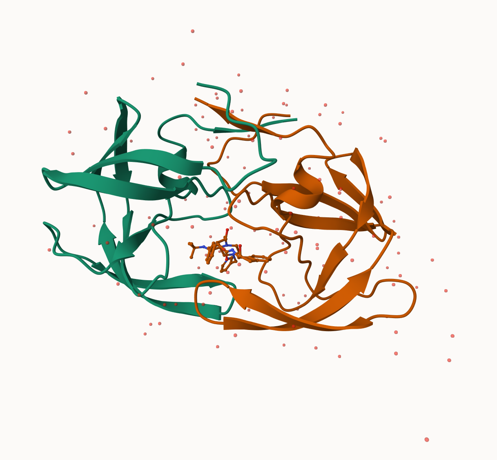
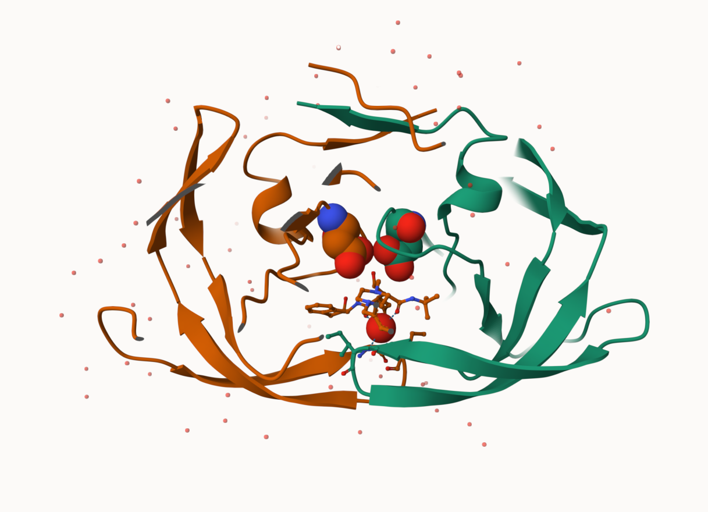
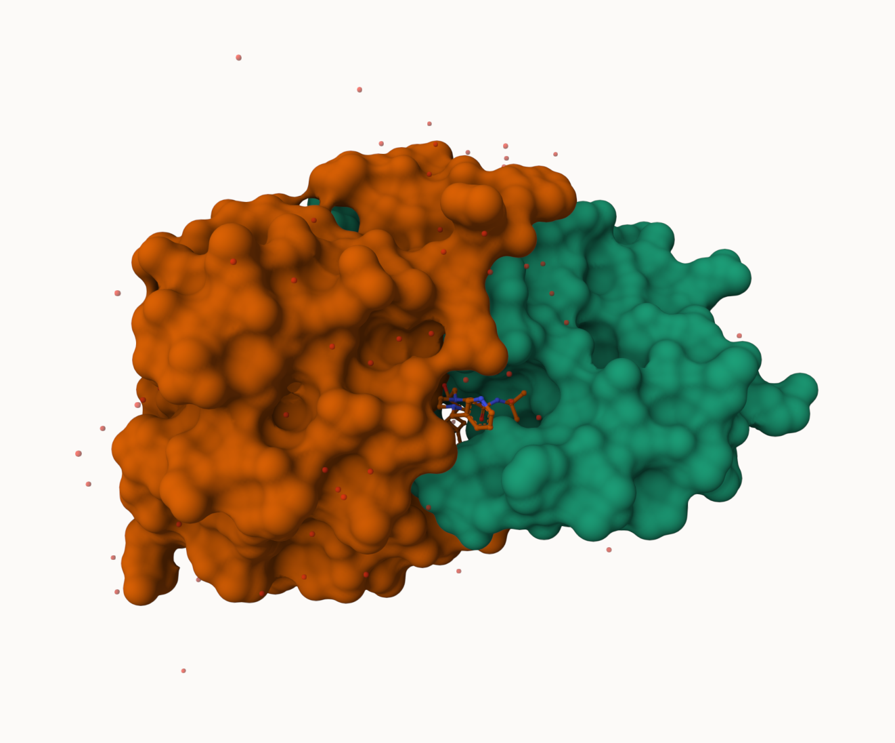

## The PDB database

The main repository for biomolecular structure data is the Protein Data Bank (PDB) https://www.rcsb.org/

Let's have a quick look at the composition of this database:
```{r}
stats <- read.csv("Data Export Summary.csv")
stats
```

> Q1: What percentage of structures in the PDB are solved by X-Ray and Electron Microscopy.

```{r}
as.numeric(sub(",", "", stats$X.ray))
```
This is annoying let's try a different import function form the **readr** package.

```{r}
library(readr)

stats <- read_csv("Data Export Summary.csv")
stats
```

Percent Xray

```{r}
n.total <- sum(stats$Total)
n.xray <- sum(stats$`X-ray`)
n.em <- sum(stats$EM)

round(n.xray/n.total*100, 2)
round(n.em/n.total*100, 2)
```

> Q2: What proportion of structures in the PDB are protein only?

```{r}
p.only <- sum(stats$Total[1])
p.only
round(p.only/n.total*100, 2)
```


> Q3. Make a bar plot overview. x protein only, NA, y number of the structurs col emperimental method stack

```{r}
library(ggplot2)

ggplot(stats, aes(x=`Molecular Type`, Total), Total) +
  geom_col() 
  
```
## Visualizing structure data

The Mol* viewer is embeded in many bioinformatics websites. The homepage is: https://molstar.org

I can insert any figure or image file using markdown format








## Bio3D package for structural bioinformatics

We can use the bio3D package to read and analyze biomolecular data in R

```{r}
library(bio3d)
hiv <- read.pdb("1hsg")
hiv
```

```{r}
head(hiv$atom)
```

Let's trim to chain A and get just it's sequence:
```{r}
chainA <- trim.pdb(hiv,chain="A")
chainA.seq <- pdbseq(chainA)
```

```{r}
trim.pdb(hiv, chain="A")
pdbseq(chainA)
```

Let's blast
```{r blast_hiv, cache=TRUE}

blast <- blast.pdb(chainA.seq)
```
```{r}
head(blast$hit.tbl)
```

Plot a quick overview of blast results

```{r}
hits <- plot(blast)
```

```{r}
hits$pdb.id
```

## Prediction of functional motions

We can run a Normal Mode Analysis (NMA) to predict large scale motions/flexibility/dynamics of any biomolecule that we can read into R.

Let's look ADK

```{r}
adk <- read.pdb("1ake")
adk_A <- trim.pdb(adk, chain="A")
adk_A
```

```{r}
m <- nma(adk_A)
plot(m)
```

Let's write out a "trajectory" of predicted motiion

```{r}
mktrj(m, file="adk_nma.pdb")
```

## Play with 3D viewing in R

We can use the new **biio3dview** package, which is not yet on CRAN, to render interactive 3D views in R and HTML quarto output reports.

To install from GitHub we can use the **pak** package.

## Comparative analysis of protein structures

Starting with a sequence or structure ID (accesion number) let's run a complete analysis pipeline.

```{r}
library(bio3d)
library(httr)

id <- "1ake_A"

aa <- get.seq(id)
aa
```
```{r}
blast <- blast.pdb(aa)
hist <- plot(blast)
```

Download all these "hits" that are similar to our id sequence

```{r}
# Download releated PDB files
files <- get.pdb(hits$pdb.id, path="pdbs", split=TRUE, gzip=TRUE)
```


```{r}
# Align releated PDBs
pdbs <- pdbaln(files, fit = TRUE, exefile="msa")
```

```{r}
pc.xray <- pca(pdbs)
plot(pc.xray)
```

```{r}
plot(pc.xray, 1:2)
```

```{r}
mktrj(pc.xray, file="pca_results.pdb")
```

```{r}
library(bio3d.view)

view.pca(pc.xray)
```

