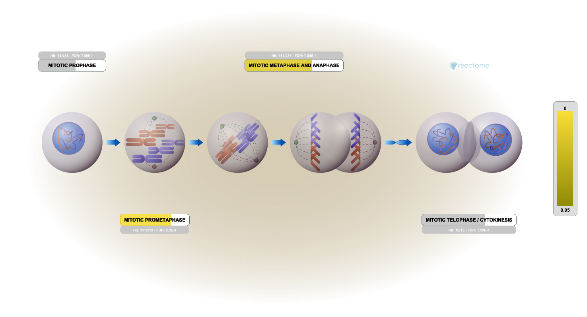

## Background

Today we will run through a complete RNASeq analysis.

The data for for hands-on session comes from GEO entry: GSE37704, which is associated with the following publication:

Trapnell C, Hendrickson DG, Sauvageau M, Goff L et al. "Differential analysis of gene regulation at transcript resolution with RNA-seq". Nat Biotechnol 2013 Jan;31(1):46-53. PMID: 23222703
The authors report on differential analysis of lung fibroblasts in response to loss of the developmental transcription factor HOXA1. Their results and others indicate that HOXA1 is required for lung fibroblast and HeLa cell cycle progression.

## Data Import

```{r}
counts <- read.csv("GSE37704_featurecounts.csv", row.names = 1)
metadata <- read.csv("GSE37704_metadata.csv")
```

Check correspondance of `metadata` and `counts` (i.e. that the columns in `counts`. atch the rows in the `metadata`)

```{r}
metadata
```
```{r}
head(counts)
```
```{r}
colnames(counts)
```
```{r}
metadata$id
```

Fix to remove that first "length" column of `counts`
```{r}
counts <- counts[,-1]
```

Also let's remove low count genes

```{r}
tot.counts <- rowSums(counts)
head(tot.counts)
```

Let's remove all zero count genes

```{r}
zero.inds <- tot.counts == 0
head(zero.inds)
```

```{r}
counts <- counts[!zero.inds,]
```


```{r}
test_cols <- !all(colnames(counts)[-1]==metadata$id)
```
```{r}
!all(c(T,T,F))
```


```{r}
if(test_cols) {
  message("Wow... there is a problem with the metadata counts setup")
}
```


## Setup for DESeq

```{r, message=FALSE}
library(DESeq2)
```


```{r}
dds <- DESeqDataSetFromMatrix(countData = counts,
                              colData = metadata,
                              design = ~condition)
```


## Run DESeq

```{r}
dds <- DESeq(dds)
```


## Get results

```{r}
res <- results(dds)
head(res)
```

## Add annotation

```{r}
library(AnnotationDbi)
library(org.Hs.eg.db)
```

```{r}
columns(org.Hs.eg.db)

res$symbol = mapIds(org.Hs.eg.db,
                    keys=row.names(res), 
                    keytype="ENSEMBL",
                    column="SYMBOL",
                    multiVals="first")

res$entrez = mapIds(org.Hs.eg.db,
                    keys=row.names(res),
                    keytype="ENSEMBL",
                    column="ENTREZID",
                    multiVals="first")

res$name =   mapIds(org.Hs.eg.db,
                    keys=row.names(res),
                    keytype="ENSEMBL",
                    column="GENENAME",
                    multiVals="first")

head(res, 10)
```


## Visualize results

```{r}
library(ggplot2)
mycols <- rep("gray", nrow(res))
mycols[ abs(res$log2FoldChange) >= 2 ] <- "blue"

inds <- (res$padj<0.01) & (abs(res$log2FoldChange) > 2 )
mycols[ inds ] <- "blue"

ggplot(res)+
  aes(log2FoldChange, -log(padj))+
  geom_point(col=mycols)+
  geom_vline(xintercept = c(-2,2), col="red")+
  geom_hline(yintercept = -log(0.05), col="red")
```

```{r}
plot( res$log2FoldChange, -log(res$padj), col=mycols, xlab="Log2(FoldChange)", ylab="-Log(P-value)" )
```


## Pathway analysis

```{r}
library(gage)
library(gageData)

data(kegg.sets.hs)
data(sigmet.idx.hs)
```

```{r}
kegg.sets.hs = kegg.sets.hs[sigmet.idx.hs]
head(kegg.sets.hs, 3)

```

```{r}
foldchanges = res$log2FoldChange
names(foldchanges) = res$entrez
head(foldchanges)
```

```{r}
keggres = gage(foldchanges, gsets=kegg.sets.hs)
head(keggres$less)
```

```{r}
library(pathview)

pathview(gene.data = foldchanges, pathway.id="hsa04110")
```

## GO analysis

```{r}
data(go.sets.hs)
data(go.subs.hs)

# Focus on Biological Process subset of GO
gobpsets = go.sets.hs[go.subs.hs$BP]

gobpres = gage(foldchanges, gsets=gobpsets, same.dir=TRUE)

lapply(gobpres, head)
```

```{r}
head(gobpres$less)
```
### Reactome

Some folks really like Reactome online (i.e. their webpage viewer <https://reactome.org/>) rather than the R package of the same name (available from bioconductor).

To use the website viewer we wnat to upload our set of gene sybols for the genes we want to focus on (here those with a P-value below 0.05)

```{r}
sig_genes <- res[res$padj <= 0.05 & !is.na(res$padj), "symbol"]

write.table(sig_genes, file="significant_genes.txt", row.names=FALSE, col.names=FALSE, quote=FALSE)
```

Example of the viewer




## Save results
```{r}
write.csv(res, file = "myresults.csv")
```

```{r}
save(res, file = "my_results.RData")
```

